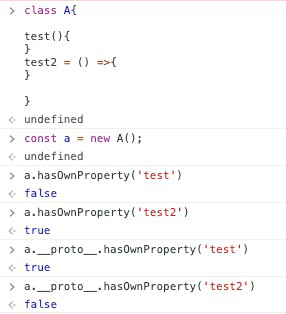

# Class To Function \( babel \)




```typescript
class A{
    test(){}
    test2 = () => {}
}
```


```typescript
"use strict";
var A = /** @class */ (function () {
    function A() {
        this.test2 = function () { };
    }
    A.prototype.test = function () { };
    return A;
}());
```


